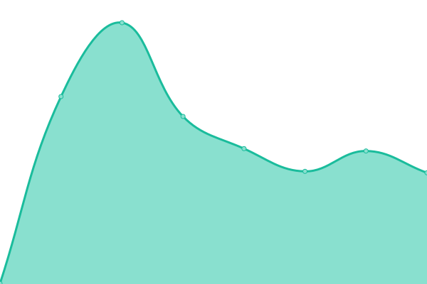

# [📈 Live Status](https://status.kyun.host): <!--live status--> **🟧 Partial outage**

This repository contains the open-source uptime monitor and status page for [kyundothost](https://status.kyun.host), powered by [Upptime](https://github.com/upptime/upptime).

With [Upptime](https://upptime.js.org), you can get your own unlimited and free uptime monitor and status page, powered entirely by a GitHub repository. We use [Issues](https://github.com/kyundothost/status/issues) as incident reports, [Actions](https://github.com/kyundothost/status/actions) as uptime monitors, and [Pages](https://status.kyun.host) for the status page.

<!--start: status pages-->
<!-- This summary is generated by Upptime (https://github.com/upptime/upptime) -->
<!-- Do not edit this manually, your changes will be overwritten -->
<!-- prettier-ignore -->
| URL | Status | History | Response Time | Uptime |
| --- | ------ | ------- | ------------- | ------ |
|  [Main API](https://api.kyun.host/ping) | 🟩 Up | [main-api.yml](https://github.com/kyundothost/status/commits/HEAD/history/main-api.yml) | 

 523ms
     
 | 

<a href="https://status.kyun.host/history/main-api">99.57%</a>
    

|  [Dro](dro.kyun.host) | 🟩 Up | [dro.yml](https://github.com/kyundothost/status/commits/HEAD/history/dro.yml) | 

 177ms
     
 | 

<a href="https://status.kyun.host/history/dro">100.00%</a>
    

|  [Neko](neko.kyun.host) | 🟩 Up | [neko.yml](https://github.com/kyundothost/status/commits/HEAD/history/neko.yml) | 

 171ms
     
 | 

<a href="https://status.kyun.host/history/neko">100.00%</a>
    

|  [Okayu](okayu.kyun.host) | 🟥 Down | [okayu.yml](https://github.com/kyundothost/status/commits/HEAD/history/okayu.yml) | 

 0ms
     
 | 

<a href="https://status.kyun.host/history/okayu">0.00%</a>
    

|  [Korone](korone.kyun.host) | 🟥 Down | [korone.yml](https://github.com/kyundothost/status/commits/HEAD/history/korone.yml) | 

 0ms
     
 | 

<a href="https://status.kyun.host/history/korone">0.00%</a>
    

|  [Subaru](subaru.kyun.host) | 🟥 Down | [subaru.yml](https://github.com/kyundothost/status/commits/HEAD/history/subaru.yml) | 

 0ms
     
 | 

<a href="https://status.kyun.host/history/subaru">0.00%</a>
    

<!--end: status pages-->

[**Visit our status website →**](https://status.kyun.host)

## 📄 License

- Powered by: [Upptime](https://github.com/upptime/upptime)
- Code: [MIT](./LICENSE) © [kyundothost](https://status.kyun.host)
- Data in the `./history` directory: [Open Database License](https://opendatacommons.org/licenses/odbl/1-0/)
